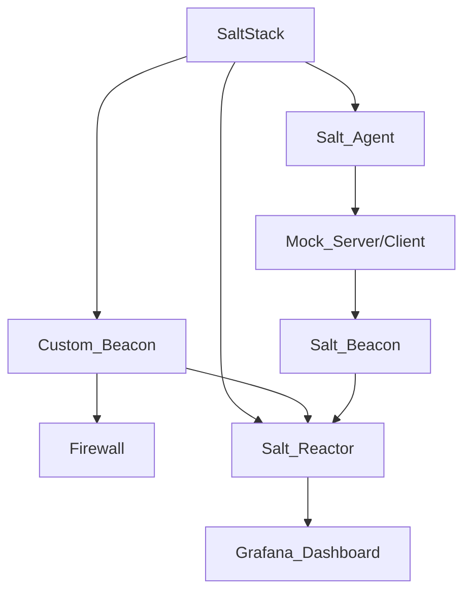

Basic Idea:
Use saltstack as the orchestrater for securty related tasks, monitoring, and alerting

- Orchestrator: Saltstack
- GUI/Dashboard: Grafana
- Salt States:
  - MockServers with beacons (e.g. https://www.mock-server.com/)
    - Canaries
  - Configurations
- Custom Runner/Beacon:
  - Firewall Logging - _which will be used to supply better rules_

---

 
